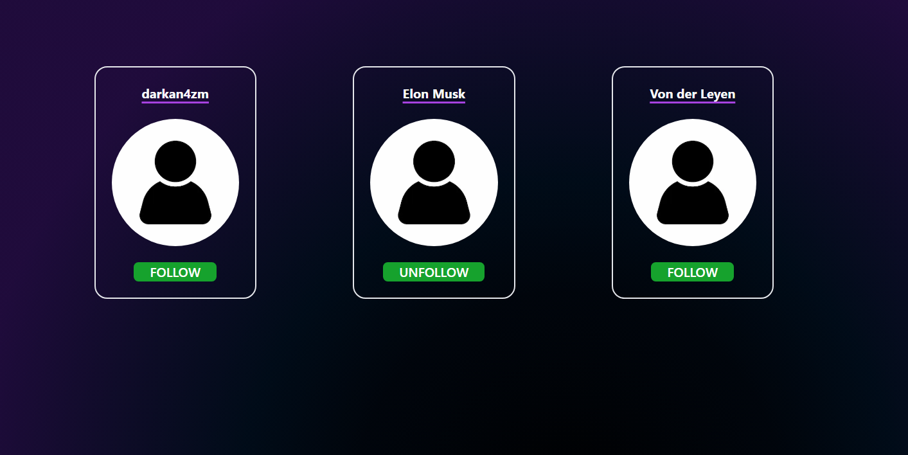
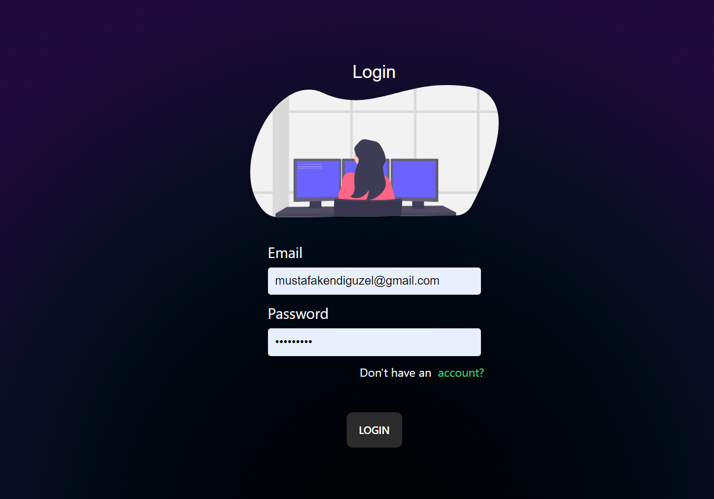
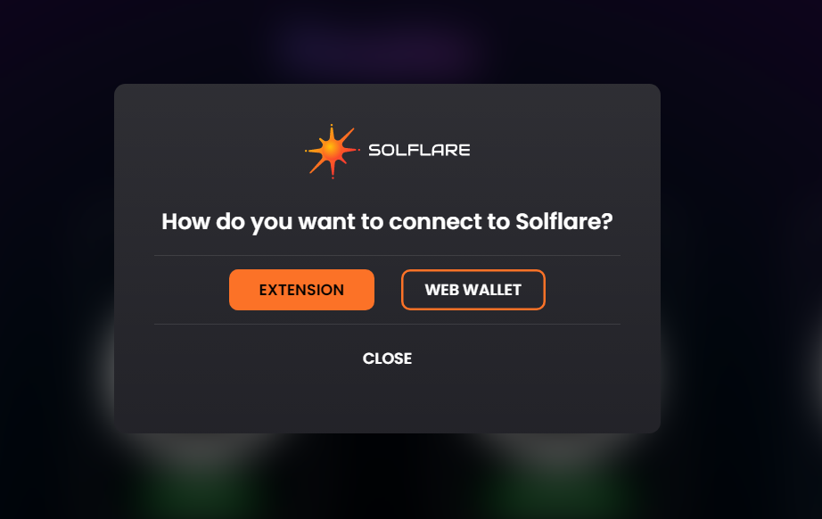

# InfLife Social

Change the lives of people you know or love by voting on their posts

Follow                    |  Login                  |     Solana Pay
:-------------------------:|:-------------------------:|:-------------------------
  |   |  

## Installation

```bash
npm install
# or
yarn install
```

## Build and Run

Next, run the development server:

```bash
npm run dev
# or
yarn dev
```

Open [http://localhost:3000](http://localhost:3000) with your browser to see the result.
You can start editing the page by modifying `pages/index.tsx`. The page auto-updates as you edit the file.

## Features

Mobile App is Soon...

## Important

Do not forgot to and .env.local his requirement for more info please look .env.example


### Structure

The scaffold project structure may vary based on the front end framework being utilized. The below is an example structure for the Next js Scaffold.
 
```
├── public : publically hosted files
├── src : primary code folders and files 
│   ├── components : should house anything considered a resuable UI component
│   ├── contexts` : any context considered reusable and useuful to many compoennts that can be passed down through a component tree
│   ├── hooks` : any functions that let you 'hook' into react state or lifecycle features from function components
│   ├── models` : any data structure that may be reused throughout the project
│   ├── pages` : the pages that host meta data and the intended `View` for the page
│   ├── stores` : stores used in state management
│   ├── styles` : contain any global and reusable styles
│   ├── utils` : any other functionality considered reusable code that can be referenced
│   ├── views` : contains the actual views of the project that include the main content and components within
style, package, configuration, and other project files

```

## Contributing

Anyone is welcome to create an issue to build, discuss or request a new feature or update to the existing code base. Please keep in mind the following when submitting an issue. We consider merging high value features that may be utilized by the majority of scaffold users. If this is not a common feature or fix, consider adding it to the component library or cookbook. Please refer to the project's architecture and style when contributing. 

If submitting a feature, please reference the project structure shown above and try to follow the overall architecture and style presented in the existing scaffold.

### Committing

To choose a task or make your own, do the following:

1. [Add an issue](https://github.com/solana-dev-adv/solana-dapp-next/issues/new) for the task and assign it to yourself or comment on the issue
2. Make a draft PR referencing the issue.

The general flow for making a contribution:

1. Fork the repo on GitHub
2. Clone the project to your own machine
3. Commit changes to your own branch
4. Push your work back up to your fork
5. Submit a Pull request so that we can review your changes

**NOTE**: Be sure to merge the latest from "upstream" before making a 
pull request!

You can find tasks on the [project board](https://github.com/solana-dev-adv/solana-dapp-next/projects/1) 
or create an issue and assign it to yourself.

